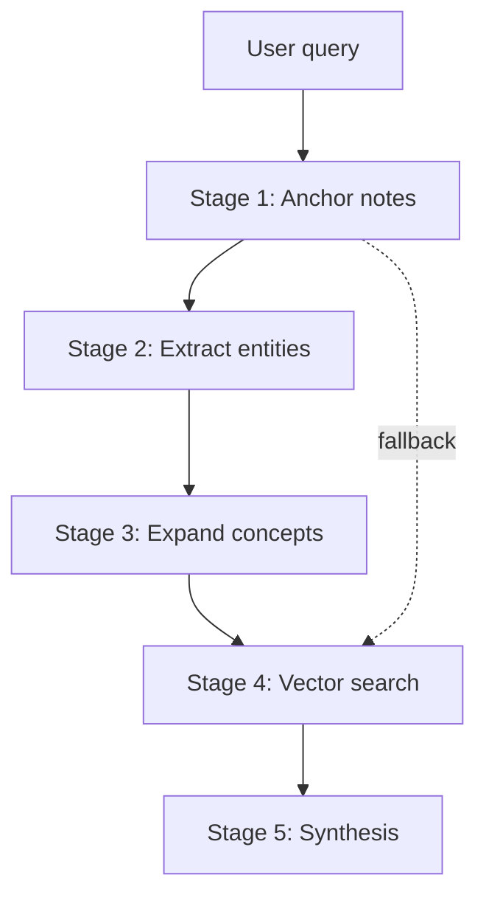

# Cascading Retrieval Flow

```mermaid
graph TD
    A["User query"] --> B["Stage 1: Anchor notes"]
    B --> C["Stage 2: Extract entities"]
    C --> D["Stage 3: Expand concepts"]
    D --> E["Stage 4: Vector search"]
    E --> F["Stage 5: Synthesis"]

    B -.->|fallback| E
```

Notes:
- Anchor stage prefers graph sources; falls back to vector if empty.
- Expansion terms are merged into the vector query to fill gaps.
