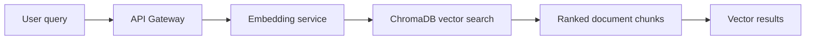
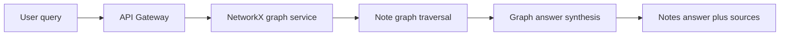
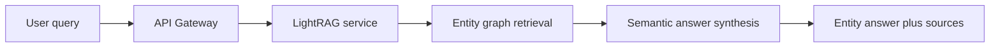
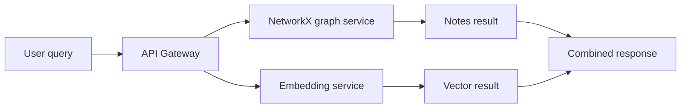
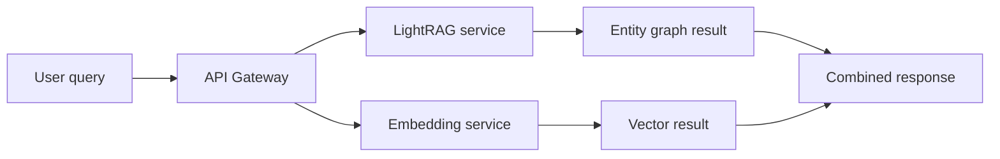
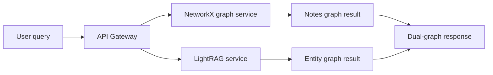
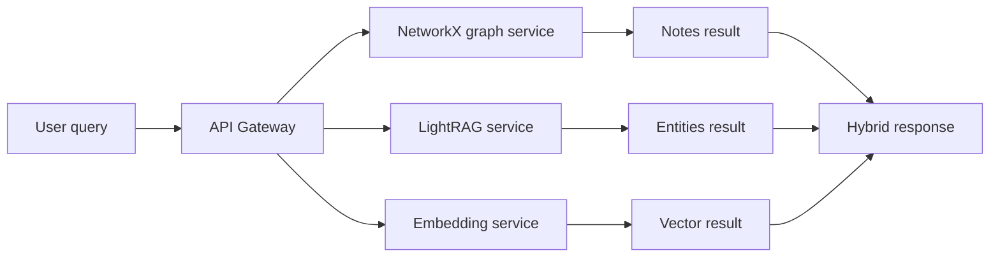
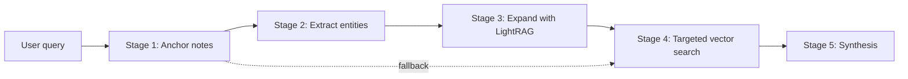
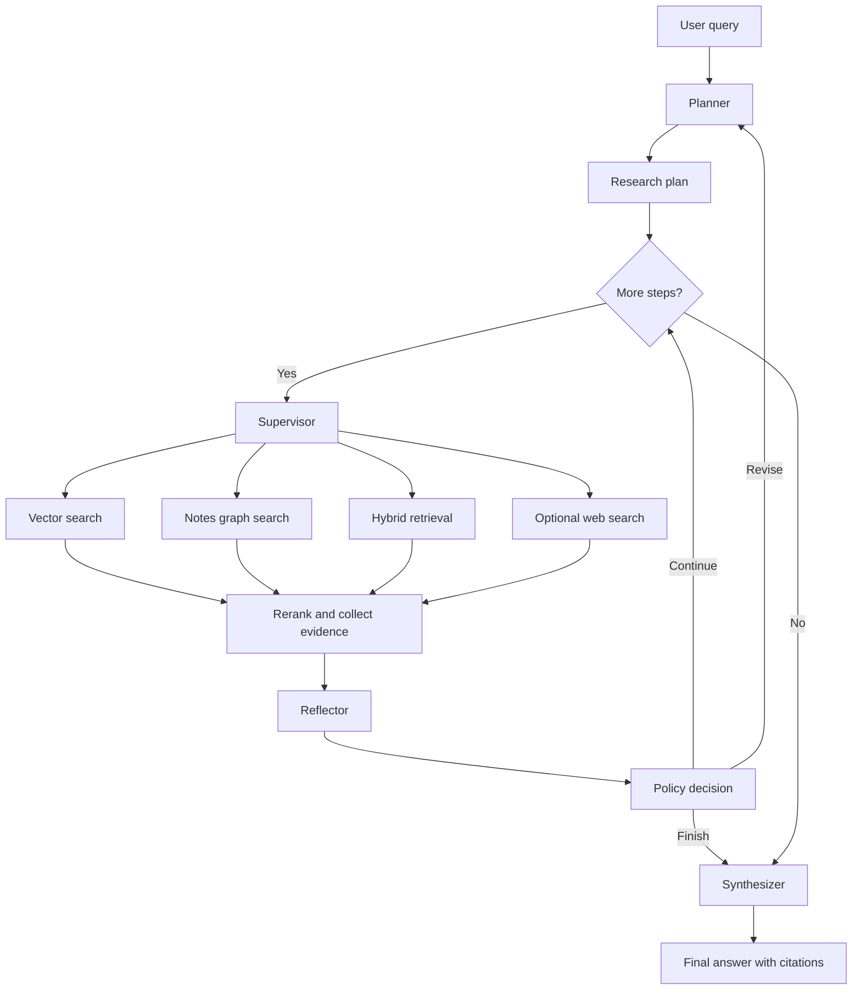

# Obsidian RAG Search Method Diagrams

This document summarizes the nine canonical search methods exposed by Obsidian RAG's public interfaces. The authoritative mode list comes from the project constitution and the unified API gateway. In practice, these methods fall into three groups:

- single-source retrieval: `vector`, `notes`, `entities`
- combined retrieval: `notes+vector`, `entities+vector`, `dual-graph`, `hybrid`
- orchestrated research flows: `cascading`, `deep-thinking`

Compatibility aliases:

- `graph` -> `notes`
- `networkx` -> `notes`
- `lightrag` -> `entities`

## 1. Vector

`vector` is the fastest retrieval path. It asks the embedding service to find semantically similar chunks in ChromaDB and returns ranked note fragments.

Example query: `How did I configure ESPHome for the garage sensor?`

Use this for fast recall, direct topic lookup, and source-first exploration.

## 2. Notes

`notes` is the note-centric graph mode. It routes the query to the NetworkX graph service, which reasons over wiki-link structure and note relationships, then synthesizes an answer from graph context.

Example query: `How are my lymphoma treatment notes connected to follow-up scan notes?`

Use this when the question is about how notes connect, relate, or cluster structurally.

## 3. Entities

`entities` is the entity-centric graph mode. It sends the query to LightRAG, which works over semantic entities and relationships rather than note links.

Example query: `What entities and treatments are associated with DLBCL in my notes?`

Use this for concept discovery, entity relationships, and multi-hop semantic retrieval.

## 4. Notes+Vector

`notes+vector` runs note-graph retrieval and vector retrieval in parallel. The gateway does not fuse them into one answer; it returns both result sets side by side.

Example query: `Show both linked-note context and direct note excerpts for Home Assistant dashboard setup.`

Use this when you want structural note reasoning and semantic chunk recall without committing to a single fused synthesis.

## 5. Entities+Vector

`entities+vector` runs LightRAG and vector search in parallel, again returning both result sets separately in one response.

Example query: `Show entity relationships and supporting note chunks for Yescarta side effects.`

Use this when you want semantic entity reasoning plus direct document evidence from the vector index.

## 6. Dual-Graph

`dual-graph` queries both graph systems in parallel: NetworkX for note-link structure and LightRAG for semantic entities. No vector search is included.

Example query: `Compare what the note graph and entity graph say about my AI agent architecture.`

Use this when you want two graph perspectives on the same question without adding vector recall.

## 7. Hybrid

`hybrid` is the broadest synchronous search mode. The gateway queries NetworkX, LightRAG, and ChromaDB in parallel and returns all three result channels together.

Example query: `What do my notes say about integrating Nextion with ESP32, with sources?`

Use this as the default general-purpose mode when you want graph reasoning, semantic entities, and source chunks in one request.

## 8. Cascading

`cascading` is a staged retrieval pipeline. It starts with anchor notes, extracts terms, expands them through LightRAG, then runs a more targeted vector search before synthesis.

Example query: `Research the best notes related to supervisor patterns in my multi-agent system.`

Use this for focused research tasks where the first retrieval pass should actively improve the later passes.

## 9. Deep-Thinking

`deep-thinking` is the long-form research agent exposed over the `deep-research` WebSocket. It plans, executes multiple retrieval steps, reflects on findings, revises the plan if needed, and then synthesizes a final answer.

Example query: `Analyze how my RAG architecture evolved, what bottlenecks remain, and which changes would likely improve reliability most.`

Use this when the query needs multi-step reasoning, plan revision, evidence accumulation, or optional external enrichment. It is much slower than the standard synchronous modes, but it handles the most complex questions.

## References

- `Documentation/PROJECT_CONSTITUTION.md`
- `src/services/api_gateway.py`
- `src/services/cascading_retriever.py`
- `Documentation/CASCADING_FLOW.md`
- `Documentation/architecture/DEEP_THINKING_FLOW.md`
