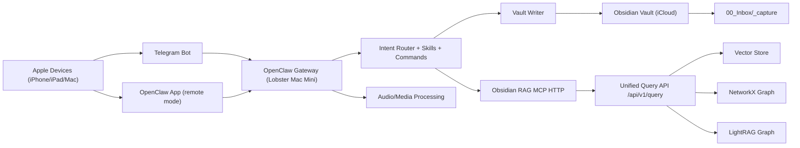
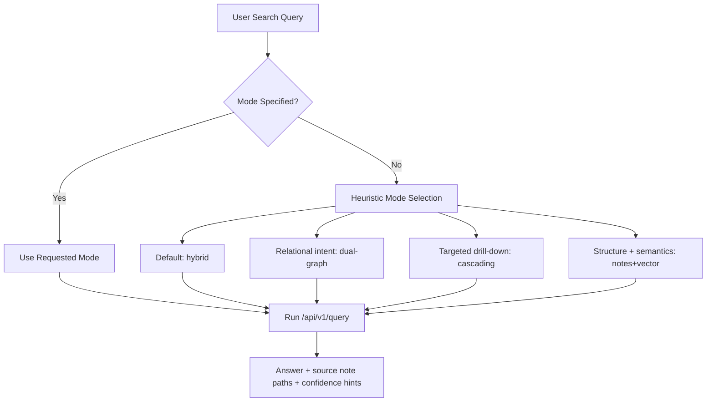
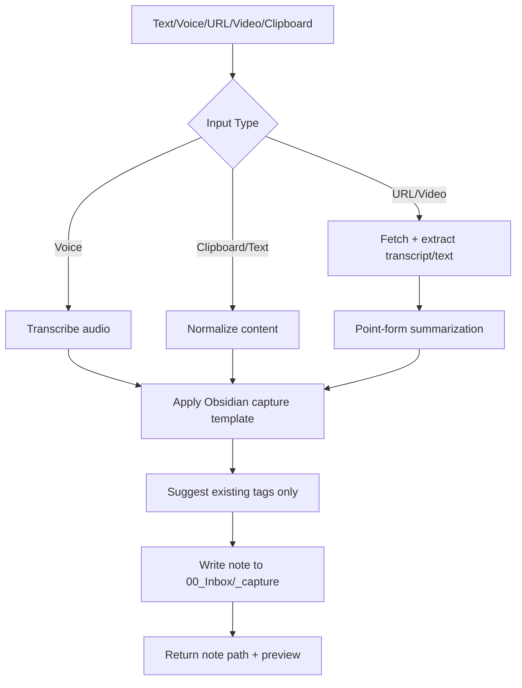

# OpenClaw Frontend Architecture for Obsidian RAG

## Objective

Use OpenClaw as a low-friction, multi-device interface for `obsidian_rag` so you can:

1. Capture text or voice notes from Apple devices into `00_Inbox/_capture`.
2. Summarize clipboard/website/video content into a templated capture note.
3. Suggest and apply existing vault tags from note context.
4. Search the vault locally and remotely with text or voice.

## Environment Baseline

- OpenClaw gateway host: `Lobster's Mac Mini`
- Vault + `obsidian_rag` source of truth: `Canmore's Mac Mini`
- Daily driver client: `MacBook Pro` (OpenClaw app + Obsidian access)
- Transport and remote connectivity: Telegram + Tailscale
- Existing MCP endpoint: `/mcp` on port `8811` with API-key auth
- Existing retrieval backend: unified query API with modes
  - `hybrid`, `dual-graph`, `cascading`, `notes+vector` (plus `vector`, `notes`, `entities`)

## Logical Architecture

## Retrieval Mode Router

## Capture and Summarization Pipeline

## Core Capabilities Design

### 1) Capture from any Apple device (text/voice)

- Entry points:
  - Telegram DM (best for phone-first capture).
  - OpenClaw desktop app (best for Mac workflows).
- Behavior:
  - Normalize into one canonical capture schema (timestamp, source, raw input, optional transcript).
  - Save to `00_Inbox/_capture/YYYY-MM-DD_HH-mm-ss_<slug>.md`.
  - Return the created vault-relative path in confirmation.

### 2) Summarize clipboard / website / video into template

- Add command family:
  - `/capture`
  - `/sumurl`
  - `/sumvideo`
  - `/clip`
- Processing:
  - URL/video ingestion -> clean text/transcript extraction.
  - Summarizer outputs concise bullet points.
  - Template renderer creates final note sections:
    - Source
    - Why it matters
    - Key points
    - Action items
    - Tags (suggested)
- Save destination always: `00_Inbox/_capture`.

### 3) Tagging from existing tags only

- Source of allowed tags:
  - Existing vault tags via indexed metadata (`tags`) and graph tag nodes.
- Flow:
  - Read note content.
  - Rank top matching tags from existing set.
  - Apply up to N tags (recommended `N=5`) to YAML frontmatter.
  - Never invent unseen tags by default.

### 4) Search locally/remotely with text or voice

- Local:
  - OpenClaw app on MacBook Pro in remote-gateway mode.
- Remote:
  - Telegram from iPhone/iPad, over standard Telegram transport.
  - Gateway connectivity protected by Tailscale and API-key auth to MCP.
- Mode handling:
  - Explicit override in command: `/search cascading <query>`.
  - Otherwise default to `hybrid`.

## Command Contract (Proposed)

- `/capture <text>`: quick thought capture.
- `/voice` or voice note: transcribe then save.
- `/clip`: summarize clipboard and save.
- `/sumurl <url>`: summarize webpage and save.
- `/sumvideo <url-or-file>`: summarize video/transcript and save.
- `/tag <note_path>`: suggest/apply existing tags.
- `/search [mode] <query>`: run unified retrieval.
- `/searchmodes`: list and explain available modes.

## Non-Functional Requirements

- Security:
  - Telegram allowlist for authorized sender IDs.
  - Keep MCP on tailnet/private network with API key.
  - Restrict writer scope to `00_Inbox/_capture`.
- Reliability:
  - Idempotency key on capture actions to avoid duplicates.
  - Retry on transient failures (network fetch/transcription).
  - Log audit trail for writes and tag changes.
- Performance:
  - P50 target:
    - capture text: <2s
    - voice transcription + save: <12s
    - standard `hybrid` search: <10s

## Phased Rollout

1. Phase 1: Search-first baseline
   - Wire OpenClaw command routing to unified query modes.
2. Phase 2: Text/voice capture
   - Add write pipeline and templates to `00_Inbox/_capture`.
3. Phase 3: URL/video summarization
   - Add extraction/transcript adapters and summary templates.
4. Phase 4: Tag enrichment
   - Add controlled existing-tag suggestion and frontmatter updates.
5. Phase 5: Hardening and observability
   - Allowlists, audit logs, retry policy, and latency dashboards.

## Open Decisions

1. Should all write operations be centralized on `Canmore's Mac Mini` only?
2. Which exact Obsidian template file(s) should capture/summarize use?
3. For tagging, should updates target only frontmatter `tags` or also inline tags?
4. Is video summarization scope YouTube-only or any URL/file upload?
5. What should be the default search response format in Telegram: short answer only, or answer + sources?
6. Should `/search` auto-switch mode heuristically, or stay fixed to `hybrid` unless user overrides?

