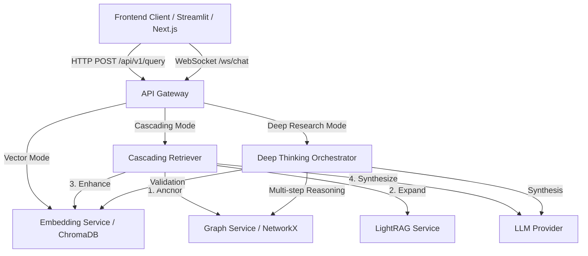
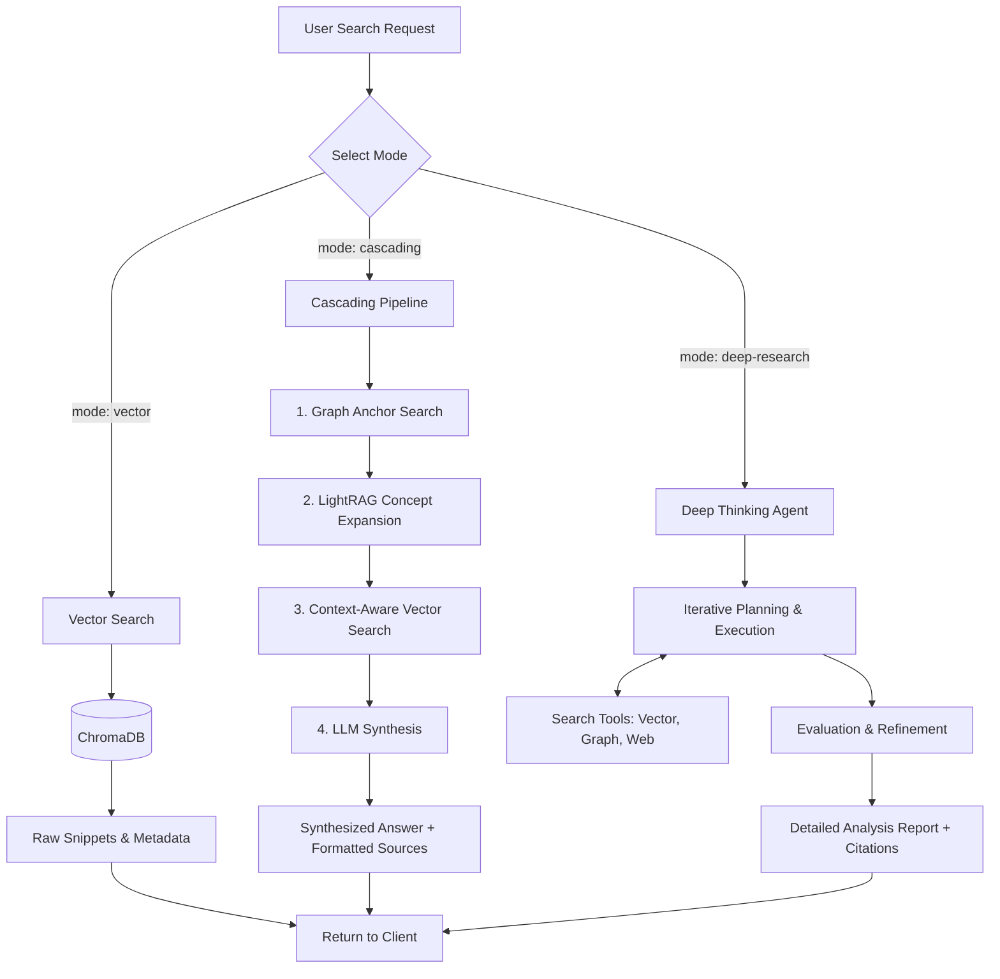

# Search Architecture

This document outlines the simplified 3-mode search architecture for Obsidian RAG, as well as the overall application data flow.

## Application Data Flow

The following flowchart describes how the frontend application, API Gateway, and backend services interact.

## Search Modes Flowchart

The API Gateway supports exactly 3 distinct search modes: `vector`, `cascading`, and `deep-research`.

## Key Characteristics

1. **Vector**: Fast, raw retrieval using embeddings. Returns source snippets directly without LLM synthesis.
2. **Cascading**: Thorough, hybrid retrieval pipeline. Uses graph topology to anchor the concept, expands understanding via LightRAG, falls back to targeted vector search, and uses an LLM to synthesize a concise answer.
3. **Deep Research**: Agentic, multi-step problem solving. Uses a supervisor agent to break down complex queries, iteratively gather information using various tools, and syntheize a comprehensive research report.
