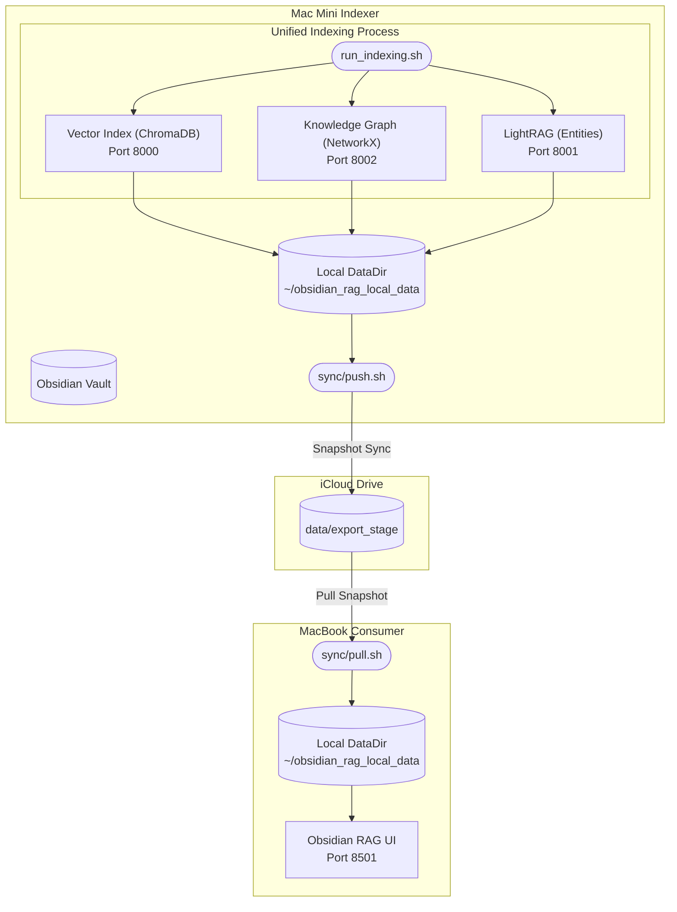

# Indexing & Data Sync Guide

## Overview

We have migrated to a **Snapshot Sync Architecture** to avoid iCloud database corruption.
- **Mac Mini (Indexer)**: Indexes data locally, then pushes a snapshot to iCloud.
- **MacBook (Consumer)**: Pulls the snapshot from iCloud to local storage for querying.
- **Safe & Fast**: Databases run on local SSDs. iCloud is only used for transfer.

---

## 🚀 Unified Procedures

### 1. Indexing (Run on Mac Mini)

**Script:** `Scripts/indexing/run_indexing.sh`

This unified script performs a complete re-index of your vault into all three databases:
1.  **ChromaDB** (Vector Search) - Port 8000
2.  **NetworkX Graph** (Note Graph) - Port 8002
3.  **LightRAG** (Entity Graph) - Port 8001

**Usage:**
```bash
# Full Re-Index
./Scripts/indexing/run_indexing.sh
```
*   You will be prompted to confirm a full re-index (deletes old data).
*   **Time:** ~30-60 mins for 2k notes.
*   **Cost:** ~$1.00 (OpenRouter LLM).

---

### 2. Export Data (Run on Mac Mini)

**Script:** `Scripts/sync/push.sh`

After indexing is complete, push the fresh data to the iCloud staging area.
This creates a stable snapshot in `~/Library/Mobile Documents/com~apple~CloudDocs/ai/RAG/obsidian_rag/data/export_stage`.

**Usage:**
```bash
./Scripts/sync/push.sh
```

---

### 3. Import Data (Run on MacBook)

**Script:** `Scripts/sync/pull.sh`

To update your MacBook with the latest SOTA data from the Mini, run the pull script.
This stops your local services, pulls the data from iCloud to your local SSD (`~/obsidian_rag_local_data`), and restarts services.

**Usage:**
```bash
./Scripts/sync/pull.sh
```

---

### 1a. Targeted Indexing (Individual Updates)

If you only need to update **one** specific index without running the full pipeline:

#### **Vector Only (ChromaDB)**
*   **Use when:** You added new notes and want them searchable immediately.
*   **Command:**
    ```bash
    ./Scripts/indexing/update_vector_db.sh
    # Use --refresh to clear and re-index updated files
    ```

#### **NetworkX Graph Only**
*   **Use when:** You want to refresh wiki-links without re-embedding text.
*   **Command:**
    ```bash
    ./Scripts/indexing/update_knowledge_graph.sh
    ```
    *   **Note:** This runs a fast structural scan (seconds). It rebuilds the graph structure in memory, so it always yields a fresh state. There is no need for complex append logic.

#### **LightRAG Only (Entities)**
*   **Use when:** You want to extract entities/relations for "Deep Thinking".
*   **Command:**
    ```bash
    ./Scripts/indexing/index_with_lightrag.sh
    ```
    *   **Note:** Incremental by default (checks file timestamps). Use `--force` to rebuild from scratch.

---

### 1b. Verify Index Freshness

To check if your Knowledge Graph is up-to-date with your vault's latest changes:

**Script:** `Scripts/debug/check_graph_status.py`

**Usage:**
```bash
./Scripts/debug/check_graph_status.py
```
*   **Status ✅:** Graph is newer than the latest note modification.
*   **Status ⚠️:** Graph is stale (lists the time difference). Re-run `./Scripts/indexing/update_knowledge_graph.sh`.

---

### 4. Daily Usage (Run on Both)

**Script:** `Scripts/setup/start_obsidian_rag.sh`

To start the system for querying/browsing.

**Usage:**
```bash
# Start Docker Services
./Scripts/setup/start_obsidian_rag.sh

# Stop Services
./Scripts/setup/stop_obsidian_rag.sh
```

---

## <div style="page-break-after:always"></div>

## Architecture Diagram



---

## Troubleshooting

### "Naive" Results on MacBook?
If you see "Naive" mode instead of "Hybrid":
1.  **Check Sync**: Did you run `pull.sh` recently?
2.  **Check Ollama**: Ensure Ollama is running (`ollama serve`). The embedding model (`nomic-embed-text`) must be available for vectors to work.
3.  **Check Logs**:
    ```bash
    docker logs obsidian-lightrag
    ```
    Verify that incoming queries show `Requested mode: 'hybrid'` and `Effective mode: 'hybrid'`.

### "Database Locked" Errors?
*   Should NOT happen with this new architecture.
*   If it does, ensure you are NOT trying to index on the MacBook or access the `data/export_stage` directly from Docker. Always use the local copies.

---

**Last Updated:** January 26, 2026
