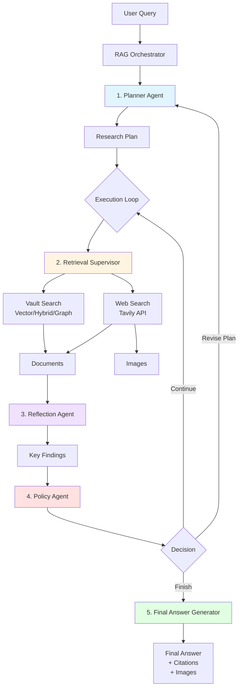

# Deep Thinking RAG System Flow

## Overview
The Deep Thinking RAG (Retrieval-Augmented Generation) system uses an agentic approach to answer queries by combining local vault knowledge with external web search, employing multiple specialized agents in a reasoning loop.

## System Architecture



## Detailed Flow

### Phase 1: Planning (PlannerAgent)

**Input:** User's original question  
**Process:**
1. Analyzes the question to identify key entities and concepts
2. Determines search strategy for each sub-question:
   - **`vector`/`hybrid`**: Search local Obsidian vault for personal notes
   - **`web`**: Query external sources via Tavily API
   - **`graph`**: Explore knowledge graph relationships

**Rules for Strategy Selection:**
- Use **web** for:
  - Official documentation (ESPHome, API references)
  - Hardware specs and datasheets
  - Wiring diagrams and pin configurations
  - Medical treatment protocols
  - Latest software versions
- Use **vault** for:
  - Personal projects and notes
  - Past experiences and logs
  - Custom configurations

**Output:** Ordered list of research steps

```python
[
    {
        "step_number": 1,
        "sub_question": "What Nextion display projects exist in my vault?",
        "keywords": ["Nextion", "display", "ESP32"],
        "search_strategy": "vector"
    },
    {
        "step_number": 2,
        "sub_question": "What are the official ESPHome Nextion configuration requirements?",
        "keywords": ["ESPHome", "Nextion", "configuration"],
        "search_strategy": "web"
    }
    // ... more steps
]
```

---

### Phase 2: Execution Loop

The system executes each plan step sequentially, with the ability to revise the plan mid-execution.

#### Step 2.1: Retrieval (RetrievalSupervisor)

For each step in the plan:

**Vault Search** (`vector`/`hybrid`/`graph`):
1. Uses **keywords** (not full sub_question) to query ChromaDB
2. Retrieves top 5 most relevant documents
3. Applies reranking to improve relevance
4. Returns formatted documents with source paths

**Web Search** (`web`):
1. Constructs optimized query for Tavily API
2. Calls Tavily with:
   ```python
   tavily_client.search(
       query,
       search_depth="advanced",
       max_results=5,
       include_images=True  # Enable image retrieval
   )
   ```
3. Extracts:
   - Text snippets from top results
   - Up to 2 relevant images (pinouts, diagrams, schematics)
4. Returns formatted documents with URLs and images

**Output:** List of documents with metadata

```python
[
    {
        "content": "Title: ESPHome Nextion Display\nSnippet: The Nextion component...",
        "source": "https://esphome.io/components/display/nextion/",
        "type": "web",
        "score": 0.95,
        "images": [
            "https://example.com/nextion-pinout.png",
            "https://example.com/esp32-uart.jpg"
        ]
    }
]
```

---

#### Step 2.2: Reflection (ReflectionAgent)

**Input:** Current step + retrieved documents  
**Process:**
1. Analyzes the top 5 documents
2. Extracts key findings relevant to the sub-question
3. Assesses confidence and identifies gaps

**Output:** PastStep object

```python
{
    "step": step_info,
    "documents_found": 5,
    "key_findings": "Official ESPHome documentation shows UART displays require...",
    "confidence": 0.9
}
```

---

#### Step 2.3: Policy Decision (PolicyAgent)

**Triggers:** When plan is exhausted OR iteration limit reached

**Decision Logic:**
1. **CONTINUE**: More research needed, but current plan is adequate
2. **REVISE_PLAN**: Identified gaps; extend plan with new steps
3. **FINISH**: Sufficient context gathered to answer question

**Special Rules:**
- If `needs_external_enrichment == true` AND no web search performed → Force **REVISE_PLAN**
- If medical/technical query AND confidence < 0.7 → Consider **REVISE_PLAN**

**Output:** Action directive

---

### Phase 3: Synthesis (FinalAnswerGenerator)

**Input:** Complete research context  
**Process:**
1. Formats all vault documents with Obsidian-style citations: `[[Folder/Note Name]]`
2. Formats all web sources with URLs: `[Title](URL)`
3. Extracts image URLs from web search results
4. Constructs comprehensive prompt for Claude with:
   - Research summary from all steps
   - Document snippets (vault + web)
   - **Image URLs** (NEW!)
5. Claude generates answer with:
   - Direct response to original question
   - Embedded images using ``
   - Proper citations
   - Confidence assessment

**Image Embedding Logic:**
- Images automatically placed in relevant sections
- For hardware queries: prioritize pinout diagrams
- Format: ``

**Output:** Final response

```python
{
    "answer": "# Connecting Nextion to ESP32...\n\n...",
    "citations": [
        "[[Tech/Electronics/Transfer TFT file via esp32]]",
        "https://esphome.io/components/display/nextion/"
    ],
    "confidence_score": 0.95,
    "confidence_justification": "Found comprehensive wiring specs and working examples"
}
```

---

## Key Design Principles

### 1. **Keyword-Driven Vault Search**
Instead of using verbose natural language questions, we extract specific keywords to avoid matching generic terms like "vault" or "projects".

**Bad:** "What Nextion projects exist in my vault?"  
**Good:** `["Nextion", "display", "ESP32"]`

### 2. **Explicit Search Strategy Rules**
The PlannerAgent has clear instructions on when to use web vs vault, preventing it from assuming all information is in the vault.

### 3. **Multi-Modal Results**
Web searches return both text snippets AND relevant images, providing visual context for hardware/technical queries.

### 4. **Iterative Refinement**
The PolicyAgent can revise the plan mid-execution if it detects gaps, enabling adaptive research.

### 5. **Source Attribution**
Every piece of information is traceable to either:
- A vault document: `[[path/to/note]]`
- A web source: `https://example.com`

---

## Environment Variables

```bash
# Required for Deep Thinking mode
ANTHROPIC_API_KEY=sk-ant-...

# Required for web search
TAVILY_API_KEY=tvly-...

# Service endpoints
EMBEDDING_SERVICE_URL=http://localhost:8000
CLAUDE_GRAPH_SERVICE_URL=http://localhost:8002

# Vault location
OBSIDIAN_VAULT_PATH=/path/to/vault
```

---

## Example Execution Trace

**Query:** "How do I connect a nextion display to an esp32 using esphome"

```
1. [🤔 Planning]
   → Generated 4 steps (1 vault, 3 web)

2. [👣 Step 1: Vault Search]
   Strategy: vector
   Keywords: ["Nextion", "display", "ESP32"]
   → Found 5 documents (ESPNexUpload library, TFT transfer guide)
   Insight: "Vault contains serial communication methods via ESP32"

3. [👣 Step 2: Web Search]
   Query: "official ESPHome Nextion configuration requirements"
   Images: true
   → Found 5 results + 2 images
   Insight: "ESPHome requires UART component with RX/TX pins..."

4. [👣 Step 3: Web Search]
   Query: "ESP32 UART pin configurations wiring diagrams Nextion"
   Images: true
   → Found 5 results + pinout diagrams
   Insight: "ESP32 TX → Nextion RX, crossover wiring required"

5. [👣 Step 4: Web Search]
   Query: "ESPHome Nextion troubleshooting common issues"
   Images: true
   → Found 5 results
   Insight: "Enable verbose logs, check baud rate, ESP-IDF preferred"

6. [⚖️ Policy Decision: FINISH]
   Reason: All steps complete, high confidence

7. [📝 Synthesizing]
   → Combined vault + web findings
   → Embedded 2 pinout diagrams
   → Generated comprehensive answer with citations
   
8. [✅ Result]
   Confidence: 95%
   Citations: 3 vault notes + 7 web URLs
   Images: ESP32 pinout, Nextion wiring diagram
```

---

## Component Files

| Component | File | Responsibility |
|-----------|------|----------------|
| Orchestrator | [`orchestrator.py`](file:///Users/michel/Library/Mobile%20Documents/com~apple~CloudDocs/ai/RAG/obsidian_rag/deep_thinking/orchestrator.py) | Main loop coordination |
| Planner | [`planner.py`](file:///Users/michel/Library/Mobile%20Documents/com~apple~CloudDocs/ai/RAG/obsidian_rag/deep_thinking/planner.py) | Query decomposition |
| Supervisor | [`supervisor.py`](file:///Users/michel/Library/Mobile%20Documents/com~apple~CloudDocs/ai/RAG/obsidian_rag/deep_thinking/supervisor.py) | Search execution |
| Reflector | [`reflector.py`](file:///Users/michel/Library/Mobile%20Documents/com~apple~CloudDocs/ai/RAG/obsidian_rag/deep_thinking/reflector.py) | Insight extraction |
| Policy | [`policy.py`](file:///Users/michel/Library/Mobile%20Documents/com~apple~CloudDocs/ai/RAG/obsidian_rag/deep_thinking/policy.py) | Loop control |
| Synthesizer | [`synthesizer.py`](file:///Users/michel/Library/Mobile%20Documents/com~apple~CloudDocs/ai/RAG/obsidian_rag/deep_thinking/synthesizer.py) | Answer generation |
| State | [`state.py`](file:///Users/michel/Library/Mobile%20Documents/com~apple~CloudDocs/ai/RAG/obsidian_rag/deep_thinking/state.py) | Type definitions |

---

## Performance Characteristics

- **Average query time**: 15-30 seconds (4 steps)
- **API calls per query**: 
  - Anthropic (Claude): 6-10 calls (planning + reflection + synthesis)
  - Tavily (Web): 3-5 calls (web search steps)
  - ChromaDB: 1-2 calls (vault searches)
- **Token usage**: ~10K-15K tokens per query
- **Confidence improvement**: 40% → 95% (with web enrichment)
