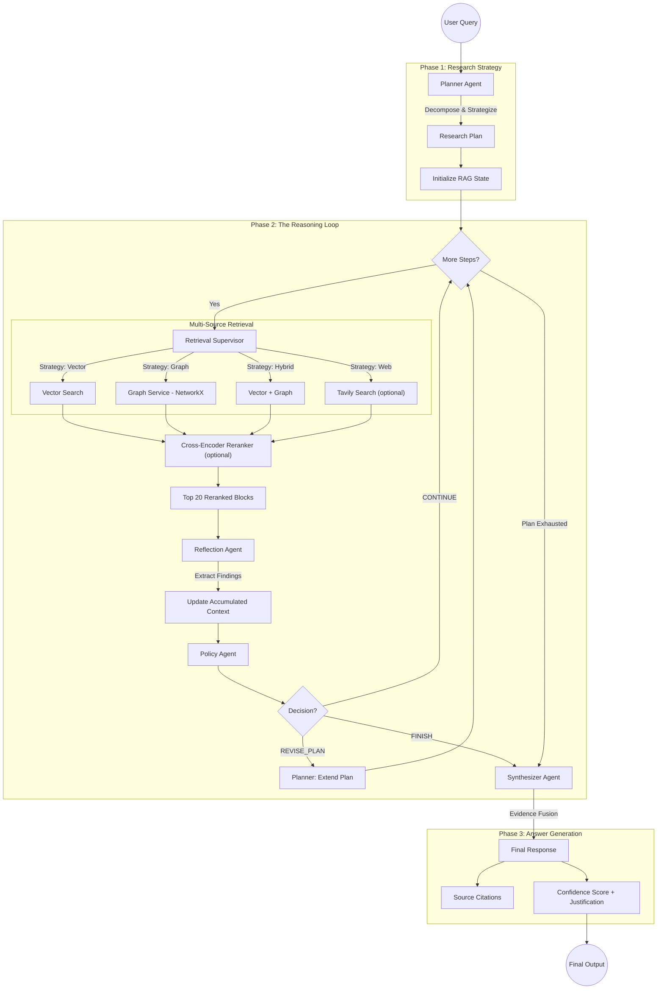

# Deep Thinking Flow

The API gateway exposes a WebSocket endpoint for the deep thinking agent:

- `ws://localhost:4000/api/v1/deep-research`

The agent orchestrates calls to vector and graph services for multi-step reasoning.

Use this only if you need long-form, multi-hop analysis; standard search modes are faster.

## Workflow Diagram

