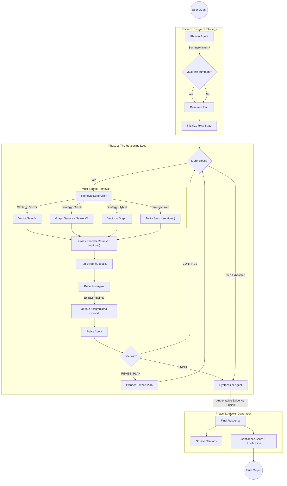

# Deep Thinking Flow

The API gateway exposes a WebSocket endpoint for the deep thinking agent:

- `ws://localhost:4000/api/v1/deep-research`

The agent orchestrates calls to vector, graph, and optional web services for multi-step reasoning.

Use this only if you need long-form, multi-hop analysis; standard search modes are faster.

## Current Runtime Notes

- Plan execution is serialized by default so reflection and policy decisions see committed intermediate state after each step.
- Summary-style queries such as "point form summary of X" use a vault-first fast path with a minimal evidence set and skip web enrichment unless the user explicitly asks for outside context, reviews, or comparisons.
- Prompt-template and instruction notes are filtered out of normal evidence ranking so workflow helper files do not appear as content sources.
- Graph steps preserve text-only graph outputs as internal reasoning evidence, but those internal reasoning documents are excluded from final citations.
- Final synthesis uses one authoritative citable evidence set for prompt construction, citation normalization, and final source rendering.
- If the model returns an empty answer, synthesis retries once with a smaller evidence set before falling back to the retrieved-context summary.
- Fallback responses now surface the failure mode, for example empty answer, malformed JSON, timeout, or provider error.

## Workflow Diagram

