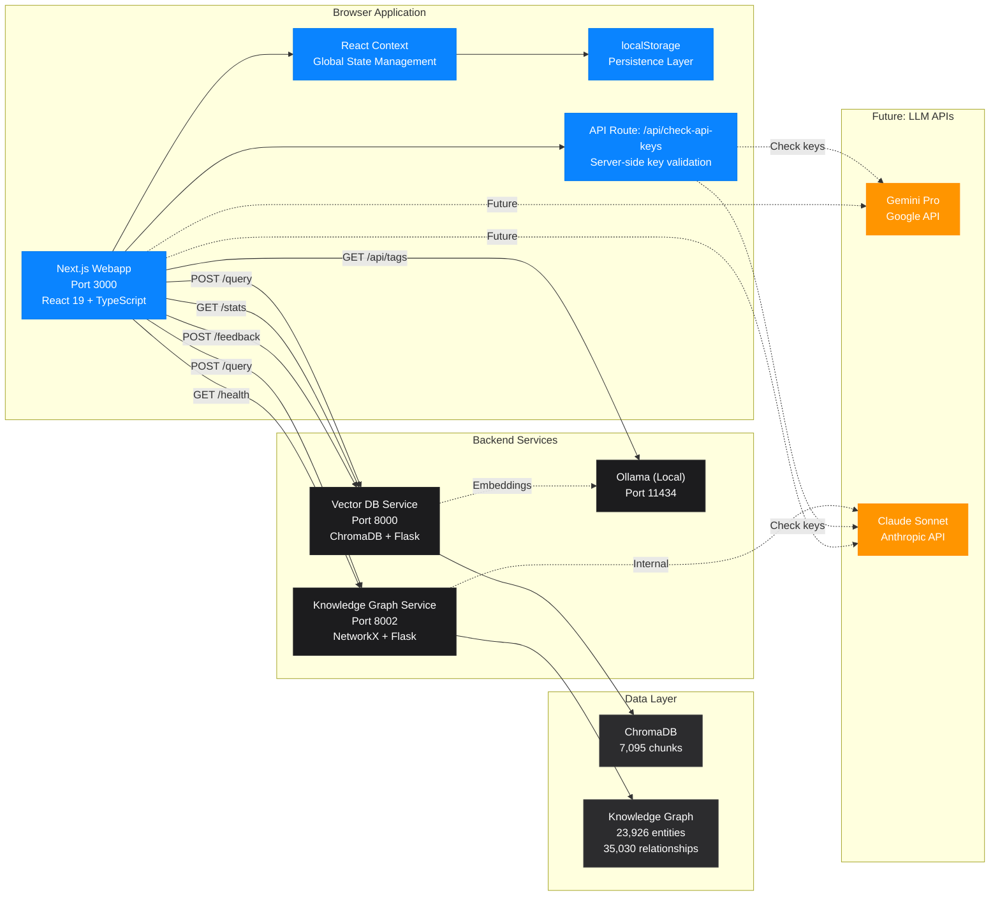

# Next.js Webapp Architecture

## Overview

This diagram shows the architecture of the new Next.js web application, which provides a modern, responsive interface with feature parity to the legacy Streamlit app.



## Component Details

### Next.js Webapp (Port 3000)
- **Technology**: Next.js 16.1.1, React 19, TypeScript 5, Tailwind CSS v4
- **Build Tool**: Turbopack
- **Directory**: `webapp/`

**Core Files**:
- `src/app/page.tsx` - Main chat interface
- `src/app/layout.tsx` - Root layout with AppProvider
- `src/context/AppContext.tsx` - Global state management
- `src/lib/api.ts` - API client for backend services
- `src/lib/types.ts` - TypeScript type definitions

**Component Structure**:
```
webapp/src/components/
├── ChatSidebar.tsx           # Main sidebar container
├── sidebar/
│   ├── ConfigurationPanel.tsx    # Compact config buttons
│   ├── ConfigButton.tsx          # Reusable button component
│   ├── SearchModePanel.tsx       # Modal: Search mode selection
│   ├── LLMProviderPanel.tsx      # Modal: LLM provider selection
│   ├── EnhancedSearchToggle.tsx  # Toggle: Enhanced search
│   ├── ServicesPanel.tsx         # Modal: Services monitoring
│   ├── SettingsPanelModal.tsx    # Modal: Advanced settings
│   ├── ActionsPanel.tsx          # Modal: Export/clear conversations
│   └── ChatHistory.tsx           # Conversation history list
└── chat/
    ├── SourcesDisplay.tsx        # Expandable sources panel
    └── RatingButtons.tsx         # 5-point emoji rating
```

### State Management

**AppContext (React Context API)**:
```typescript
interface AppState {
  // Configuration
  searchMode: 'vector' | 'knowledge-graph' | 'hybrid'
  llmProvider: 'ollama' | 'gemini' | 'claude'

  // Settings
  settings: {
    model: string              // e.g., 'llama2:latest'
    sources: number            // 1-50
    temperature: number        // 0.0-1.0
    showSources: boolean
    enhancedSearch: boolean
  }

  // Services status
  services: {
    vectorDB: { available: boolean, chunks: number }
    knowledgeGraph: { available: boolean, entities: number, relationships: number }
    ollama: { available: boolean, models: string[] }
  }

  // Chat
  messages: Message[]
  chatHistory: SavedConversation[]
}
```

**localStorage Persistence**:
- Automatic save on state changes
- Restore on app mount
- Keys: `obsidian-rag-*` prefix
- Survives browser refresh

### API Client (`src/lib/api.ts`)

**Endpoints**:
```typescript
api.vectorSearch(query, n_results)
  → POST http://localhost:8000/query
  → Returns: SearchResult[]

api.graphQuery(query, model?, system_prompt?)
  → POST http://localhost:8002/query
  → Returns: string (complete answer)

api.getStats()
  → GET http://localhost:8000/stats
  → GET http://localhost:8002/health
  → Returns: { documents: number, graph: object }

api.getOllamaModels()
  → GET http://localhost:11434/api/tags
  → Returns: string[] (model names)

api.submitFeedback(feedback)
  → POST http://localhost:8000/feedback
  → Returns: void

api.checkApiKeys()
  → GET /api/check-api-keys (Next.js API route)
  → Returns: { gemini: boolean, anthropic: boolean }
```

### UI Components

**Configuration Panel** (Compact Design):
```
┌─────────────────────────┐
│ CONFIGURATION PANEL     │
├─────────────────────────┤
│  🔍 Search Mode         │
│      Hybrid          >  │  ← Click opens modal
├─────────────────────────┤
│  🤖 LLM Provider        │
│      Ollama          >  │  ← Click opens modal
├─────────────────────────┤
│  🌐 Enhanced Search     │
│      Enabled         ⭘  │  ← Toggle switch
├─────────────────────────┤
│  📊 Services            │
│      3/3 Online      >  │  ← Click opens modal
├─────────────────────────┤
│  ⚙️ Settings            │
│      Configure       >  │  ← Click opens modal
├─────────────────────────┤
│  💾 Actions             │
│      Manage          >  │  ← Click opens modal
└─────────────────────────┘
```

**Modal Panels**:
1. **Search Mode Panel**: Radio buttons for Vector/Knowledge-Graph/Hybrid
2. **LLM Provider Panel**: Radio buttons for Ollama/Gemini/Claude + API key status
3. **Services Panel**: Real-time monitoring with refresh button
4. **Settings Panel**: Model dropdown, sliders, toggles
5. **Actions Panel**: Export to markdown, clear conversation

**Chat Interface**:
- User messages: Right-aligned, blue background
- Assistant messages: Left-aligned, dark background
- Sources: Expandable accordion with relevance scores
- Ratings: 5 emoji buttons (😞😕😐😊😍)
- Thinking indicator: Animated during API calls

### Data Flow Patterns

**Vector Search Flow**:
```
User types query → handleSendMessage()
     ↓
api.vectorSearch(query, settings.sources)
     ↓
POST /query → Vector DB Service
     ↓
Return SearchResult[] → sources
     ↓
Display sources (if showSources enabled)
     ↓
[Future: Generate answer with selected LLM]
     ↓
Add message to state → localStorage
```

**Knowledge Graph Flow**:
```
User types query → handleSendMessage()
     ↓
api.graphQuery(query, undefined, systemPrompt)
     ↓
POST /query → Graph Service (no model param)
     ↓
Graph Service uses Claude internally
     ↓
Return complete answer → display directly
     ↓
Add message to state → localStorage
```

**Hybrid Flow**:
```
User types query → handleSendMessage()
     ↓
Parallel:
  ├─→ api.graphQuery() → Graph answer
  └─→ api.vectorSearch() → Sources
     ↓
Combine: answer + sources
     ↓
Add message to state → localStorage
```

## Configuration Files

**package.json** (Dependencies):
```json
{
  "dependencies": {
    "next": "16.1.1",
    "react": "19.2.3",
    "react-dom": "19.2.3",
    "react-markdown": "^10.1.0",
    "remark-gfm": "^4.0.1",
    "date-fns": "^3.0.0"
  },
  "devDependencies": {
    "@tailwindcss/postcss": "^4.0.0",
    "@tailwindcss/typography": "^0.5.16",
    "typescript": "^5"
  }
}
```

**Environment Variables** (.env.local):
```bash
# Server-side only (never exposed to browser)
ANTHROPIC_API_KEY=sk-ant-...
GEMINI_API_KEY=AIza...
```

**Next.js API Route** (/api/check-api-keys):
```typescript
// Server-side route to check API key existence
// Returns boolean status without exposing keys
GET /api/check-api-keys
→ { gemini: true, anthropic: true }
```

## Styling

**Design System**:
- **Framework**: Tailwind CSS v4
- **Theme**: Dark mode (macOS-inspired)
- **Colors**:
  - Primary: `#0A84FF` (blue)
  - Background: `#000000`, `#1C1C1E`, `#2C2C2E`
  - Text: White with varying opacity
- **Typography**: System font stack, monospace for code
- **Spacing**: Consistent 4px grid
- **Borders**: Rounded corners, subtle shadows

## Performance Optimizations

1. **React 19 Features**: Automatic batching, concurrent rendering
2. **Turbopack**: Fast dev server, instant HMR
3. **Component Lazy Loading**: Modal panels loaded on demand
4. **localStorage**: Cached state, instant restore
5. **Parallel API Calls**: Hybrid mode fetches in parallel
6. **Optimistic Updates**: UI updates before API confirmation

## State Persistence

**Saved to localStorage**:
- Search mode selection
- LLM provider selection
- All settings (model, sources, temperature, toggles)
- Chat history (up to 50 recent conversations)
- Service status (cached for 5 minutes)

**Not Persisted**:
- Current conversation messages (cleared on refresh)
- Thinking/loading states
- Error states

## Future Enhancements

### Phase 1 (Current Status)
✅ Compact configuration panel
✅ Modal-based settings
✅ Services monitoring
✅ Enhanced search toggle
✅ Chat history
✅ Rating system
✅ localStorage persistence

### Phase 2 (In Progress)
✅ Actions panel (export/clear)
⏳ Direct Ollama integration for vector mode
⏳ Direct Claude/Gemini API calls
⏳ Markdown rendering for responses
⏳ Code syntax highlighting
⏳ Real-time streaming responses

### Phase 3 (Future)
🔮 User authentication
🔮 Multi-user support
🔮 Conversation sharing
🔮 Advanced prompt templates
🔮 Custom system prompts per mode
🔮 Response regeneration
🔮 Mobile-optimized UI

## Development

**Commands**:
```bash
# Install dependencies
cd webapp && npm install

# Development server
npm run dev  # http://localhost:3000

# Production build
npm run build
npm start

# Linting
npm run lint
```

**File Watching**:
- Turbopack watches all source files
- Hot Module Replacement (HMR)
- Instant updates on save
- TypeScript type checking in real-time

## Deployment

**Development**:
- Next.js dev server with Turbopack
- Port 3000 (configurable)
- Hot reload enabled

**Production**:
- `npm run build` → Static optimization
- `npm start` → Node.js server
- Environment variables via .env.local
- No Docker container (runs on host)

## Advantages

✅ **Modern stack** - React 19, Next.js 16, TypeScript 5
✅ **Responsive** - Mobile and desktop optimized
✅ **Persistent state** - Survives browser refresh
✅ **Type-safe** - Full TypeScript coverage
✅ **Fast development** - Turbopack HMR
✅ **Clean UI** - Compact, modal-based design
✅ **API-first** - Easy to extend and integrate

## Current Limitations

⚠️ **Vector mode incomplete** - No LLM answer generation yet
⚠️ **No authentication** - Open access
⚠️ **In development** - Not production-ready yet
⚠️ **No markdown rendering** - Plain text responses only

## Comparison with Streamlit

| Feature | Streamlit | Next.js | Status |
|---------|-----------|---------|--------|
| Search Modes | ✅ | ✅ | Complete |
| LLM Selection | ✅ | ✅ | Complete |
| Service Monitoring | ✅ | ✅ | Complete |
| Settings Panel | ✅ | ✅ | Complete |
| Enhanced Search | ✅ | ✅ | Complete |
| Chat History | ✅ | ✅ | Complete |
| Rating System | ✅ | ✅ | Complete |
| Export Conversation | ✅ | ✅ | Complete |
| Markdown Rendering | ✅ | ⏳ | Planned |
| State Persistence | ❌ | ✅ | Better |
| Mobile Support | ⚠️ | ✅ | Better |
| Type Safety | ❌ | ✅ | Better |
| Development Speed | ⚠️ | ✅ | Better |

---

**Status**: In Development (Beta)
**Last Updated**: December 27, 2025
**Target Release**: Q1 2026
