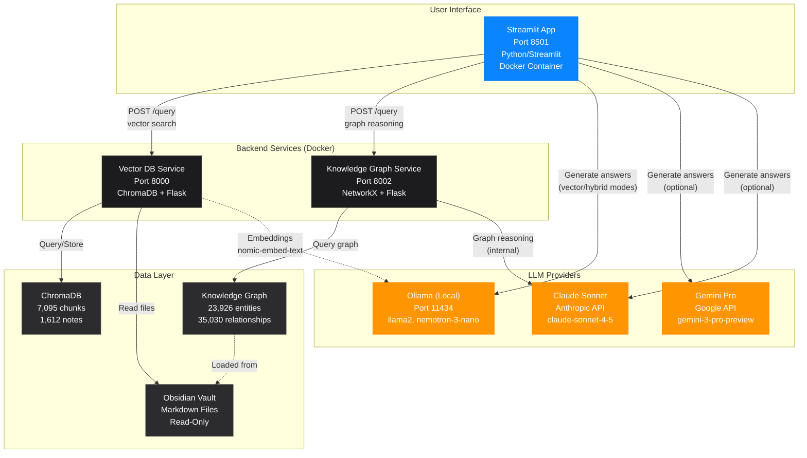

# Legacy Streamlit App Architecture

## Overview

This diagram shows the architecture of the legacy Streamlit application, which is the fully-functional production interface for the Obsidian RAG system.



## Component Details

### Streamlit App (Port 8501)
- **Container**: `obsidian-ui`
- **Technology**: Python 3.12, Streamlit framework
- **File**: `src/ui/streamlit_ui_docker.py`

**Features**:
- **Search Modes**: Vector, Knowledge-Graph, Hybrid
- **LLM Selection**: Ollama, Gemini Pro, Claude Sonnet
- **Settings**: Model selection, sources (1-50), temperature (0.0-1.0)
- **Enhanced Search**: Optional web search integration
- **Chat History**: Session-based conversation history
- **Export**: Save conversations to markdown
- **Rating System**: 5-star feedback on responses

**Configuration Options**:
```python
search_mode: 'vector' | 'knowledge-graph' | 'hybrid'
llm_provider: 'ollama' | 'gemini' | 'claude'
model: str  # e.g., 'llama2:latest'
num_sources: int  # 1-50
temperature: float  # 0.0-1.0
show_sources: bool
enhanced_search: bool
```

### Vector DB Service (Port 8000)
- **Container**: `obsidian-embedding`
- **Technology**: Flask, ChromaDB, Sentence Transformers
- **File**: `src/services/embedding_service.py`

**Endpoints**:
- `POST /query` - Semantic vector search
- `GET /stats` - Database statistics
- `POST /feedback` - Submit user ratings

**Features**:
- Semantic similarity search
- Re-ranking and deduplication
- Relevance scoring (0-100%)

### Knowledge Graph Service (Port 8002)
- **Container**: `obsidian-graph-service`
- **Technology**: Flask, NetworkX, Claude API
- **File**: `src/services/graph_query_service.py`

**Endpoints**:
- `POST /query` - Graph reasoning queries
- `GET /health` - Service status + graph stats

**Features**:
- Entity-relationship reasoning
- Uses Claude Sonnet 4.5 internally
- Returns synthesized answers (no additional LLM needed)

## Data Flow Patterns

### Vector Search Flow
```
User Query → Streamlit UI
     ↓
POST /query → Vector DB Service
     ↓
Embed query → Ollama (nomic-embed-text)
     ↓
ChromaDB similarity search → Top N chunks
     ↓
Return sources to Streamlit
     ↓
Generate answer → Selected LLM (Ollama/Gemini/Claude)
     ↓
Display to user
```

### Knowledge Graph Flow
```
User Query → Streamlit UI
     ↓
POST /query → Graph Service
     ↓
Extract entities → NetworkX graph query
     ↓
Reason over relationships → Claude API (internal)
     ↓
Return complete answer → Streamlit
     ↓
Display to user (no additional LLM needed)
```

### Hybrid Flow
```
User Query → Streamlit UI
     ↓
Parallel:
  ├─→ Graph Service → Complete answer
  └─→ Vector DB → Source documents
     ↓
Combine: Graph answer + Vector sources
     ↓
Display to user
```

## Environment Variables

```bash
# Required
EMBEDDING_SERVICE_URL=http://embedding-service:8000
CLAUDE_GRAPH_SERVICE_URL=http://graph-service:8002
OLLAMA_HOST=http://host.docker.internal:11434

# Optional LLM Providers
ANTHROPIC_API_KEY=sk-ant-...  # For Claude
GEMINI_API_KEY=AIza...        # For Gemini

# Graph Service (uses OpenRouter)
OPENROUTER_API_KEY=sk-or-...
KIMI_MODEL=moonshotai/kimi-k2-0905

# Model defaults
EMBED_MODEL=nomic-embed-text
```

## User Interface Elements

### Sidebar Controls
1. **Search Mode Selector** (Radio buttons)
   - Vector: Fast semantic search 🔍
   - Knowledge-Graph: Deep reasoning 🧠
   - Hybrid: Best of both worlds 🔗

2. **LLM Provider Selector** (Radio buttons)
   - Ollama (Free, local)
   - Gemini Pro ($ API)
   - Claude Sonnet ($ API)

3. **Settings Panel**
   - Model dropdown (populated from Ollama)
   - Sources slider (1-50)
   - Temperature slider (0.0-1.0)
   - Show Sources checkbox
   - Enhanced Search checkbox

4. **Service Status**
   - Vector DB: ✅/❌ + document count
   - Knowledge Graph: ✅/❌ + status
   - Ollama: ✅/❌ + model count

5. **Actions**
   - 💾 Export conversation
   - 🗑️ Clear conversation

### Main Chat Area
- Chat message display (user/assistant)
- Expandable sources panel (when enabled)
- 5-star rating buttons per response
- Streaming indicators during generation

## Performance Characteristics

| Operation | Typical Latency | Notes |
|-----------|----------------|-------|
| Vector Search | 100-500ms | Depends on chunk count |
| Graph Reasoning | 2-5s | Claude API latency |
| Hybrid Mode | 3-6s | Parallel execution |
| Ollama Generation | 1-3s | Local inference |
| Gemini/Claude Gen | 2-4s | API latency |
| Service Health Check | <100ms | Cached in Docker |

## Storage

- **Session State**: In-memory (Streamlit session)
- **Conversations**: Ephemeral (lost on refresh)
- **Export**: Manual save to ~/Downloads
- **No persistence**: Fresh state on each session

## Docker Configuration

```yaml
streamlit-ui:
  build:
    context: .
    dockerfile: config/docker/Dockerfile.streamlit
  container_name: obsidian-ui
  ports:
    - "8501:8501"
  volumes:
    - ./streamlit.log:/app/streamlit.log:rw
  environment:
    - EMBEDDING_SERVICE_URL=http://embedding-service:8000
    - CLAUDE_GRAPH_SERVICE_URL=http://graph-service:8002
    - OLLAMA_HOST=http://host.docker.internal:11434
    - ANTHROPIC_API_KEY=${ANTHROPIC_API_KEY}
  networks:
    - rag-network
```

## Advantages

✅ **Fully functional** - All features implemented and tested
✅ **Production-ready** - Stable, reliable, well-tested
✅ **Simple deployment** - Single Docker container
✅ **Rich UI** - All controls visible and accessible
✅ **Direct LLM access** - Can use any provider
✅ **Session-based** - No complex state management

## Limitations

❌ **No persistence** - Chat history lost on refresh
❌ **No authentication** - Open access
❌ **Desktop-focused** - Not optimized for mobile
❌ **Streamlit overhead** - Heavier than needed
❌ **Python dependency** - Requires Python runtime

---

**Status**: Production (Stable)
**Last Updated**: December 27, 2025
