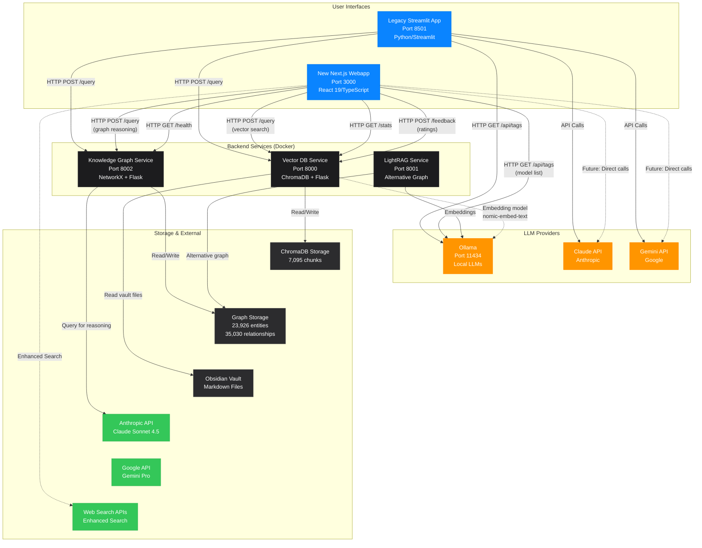

# Obsidian RAG System Architecture

## System Overview

This diagram shows the complete architecture of the Obsidian RAG system, including both the legacy Streamlit app and the new Next.js webapp, their interactions with backend services, and external dependencies.



## Component Details

### User Interfaces

#### Legacy Streamlit App (Port 8501)
- **Technology**: Python 3.12, Streamlit
- **Features**:
  - Full-featured UI with all controls
  - Search mode selection (Vector, Knowledge-Graph, Hybrid)
  - LLM provider selection (Ollama, Gemini, Claude)
  - Real-time service monitoring
  - Chat history and export
  - Rating system
- **Status**: Production-ready, fully functional

#### Next.js Webapp (Port 3000)
- **Technology**: Next.js 16.1.1, React 19, TypeScript 5
- **Features**:
  - Modern, responsive UI with compact configuration panel
  - Modal-based settings and service monitoring
  - Real-time statistics display
  - Global state management with React Context + localStorage
  - Feature parity with Streamlit app
- **Status**: In development, core features implemented

### Backend Services (Docker)

#### Vector DB Service (Port 8000)
- **Technology**: Flask, ChromaDB, Sentence Transformers
- **Data**: 7,095 document chunks, ~1,612 notes
- **Endpoints**:
  - `POST /query` - Semantic search with re-ranking
  - `GET /stats` - Database statistics
  - `POST /feedback` - User rating submission
- **Features**:
  - Semantic vector search
  - Re-ranking and deduplication
  - Relevance scoring

#### Knowledge Graph Service (Port 8002)
- **Technology**: Flask, NetworkX, Claude API
- **Data**: 23,926 entities, 35,030 relationships
- **Endpoints**:
  - `POST /query` - Graph reasoning queries
  - `GET /health` - Service health + graph stats
- **Features**:
  - Deep reasoning with entity relationships
  - Uses Claude Sonnet 4.5 internally
  - Complete answer synthesis

#### LightRAG Service (Port 8001)
- **Technology**: LightRAG framework
- **Purpose**: Alternative knowledge graph implementation
- **Status**: Available but not primary service

### LLM Providers

#### Ollama (Port 11434)
- **Type**: Local LLM runtime
- **Models**:
  - `llama2:latest` - Chat model
  - `nemotron-3-nano:latest` - Chat model
  - `nomic-embed-text:latest` - Embedding model
  - `mxbai-embed-large:latest` - Embedding model
- **Usage**:
  - Default for vector search responses
  - Embeddings for ChromaDB
  - Free, local inference

#### Claude API
- **Provider**: Anthropic
- **Models**: Claude Sonnet 4.5
- **Usage**:
  - Knowledge Graph service (internal)
  - Future: Direct webapp calls for vector mode
- **Requires**: ANTHROPIC_API_KEY

#### Gemini API
- **Provider**: Google
- **Models**: Gemini Pro
- **Usage**: Optional alternative LLM provider
- **Requires**: GEMINI_API_KEY

### Data Flow Patterns

#### Vector Search Flow
```
User Query → Webapp/Streamlit → Vector DB Service
           ↓
Vector DB embeds query → Ollama (nomic-embed-text)
           ↓
ChromaDB similarity search → Top N chunks
           ↓
Re-ranking & deduplication
           ↓
Return sources to UI
           ↓
LLM generates answer (Ollama/Claude/Gemini)
```

#### Knowledge Graph Flow
```
User Query → Webapp/Streamlit → Graph Service
           ↓
Graph Service analyzes query
           ↓
Extracts entities from graph (NetworkX)
           ↓
Claude API reasons over relationships
           ↓
Returns synthesized answer (ready to display)
```

#### Hybrid Flow
```
User Query → Both Vector DB + Graph Service (parallel)
           ↓
Graph answer (primary) + Vector sources (context)
           ↓
Combined response with sources
```

## API Key Configuration

### Server-side (.env)
```bash
ANTHROPIC_API_KEY=sk-ant-...
GEMINI_API_KEY=AIza...
OPENROUTER_API_KEY=sk-or-...  # For graph service
```

### Webapp (.env.local)
```bash
# Same keys for API route verification
ANTHROPIC_API_KEY=sk-ant-...
GEMINI_API_KEY=AIza...
```

### Docker Containers
- Keys passed via environment variables in docker-compose.yml
- Graph service: Uses OPENROUTER_API_KEY internally
- Streamlit UI: Uses all provider keys

## State Management

### Webapp (Next.js)
- **Global State**: React Context API
- **Persistence**: localStorage
- **State includes**:
  - Search mode (vector/knowledge-graph/hybrid)
  - LLM provider (ollama/gemini/claude)
  - Settings (model, sources, temperature, flags)
  - Services status (vectorDB, knowledgeGraph, ollama)
  - Messages (chat history)
  - Chat history (recent conversations)

### Legacy App (Streamlit)
- **Session State**: Streamlit session_state
- **Persistence**: Export to markdown only
- **State includes**:
  - Same configuration options
  - Message history
  - Active provider selection

## Network Architecture

```
Port 3000  ← Next.js Dev Server (Turbopack)
Port 8000  ← Vector DB Service (Docker)
Port 8001  ← LightRAG Service (Docker)
Port 8002  ← Knowledge Graph Service (Docker)
Port 8501  ← Streamlit UI (Docker)
Port 11434 ← Ollama (Host machine)
```

All services communicate over HTTP REST APIs with JSON payloads.

## Data Volumes

### Docker Volumes
- `graph_storage` - Knowledge graph data (23,926 entities)
- `lightrag_storage` - LightRAG database
- Local mount: `./chroma_db` - Vector database (7,095 chunks)
- Read-only: `OBSIDIAN_VAULT_PATH` - Source markdown files

### Webapp Storage
- Browser localStorage - User preferences, chat history
- No server-side persistence (stateless)

## Deployment Patterns

### Development
- Next.js: `npm run dev` (localhost:3000)
- Services: `docker-compose up -d`
- Ollama: Native macOS app

### Production
- Next.js: `npm run build && npm start`
- Services: Same docker-compose
- Environment variables via .env files

## Security Considerations

1. **API Keys**: Never exposed to client browser
2. **CORS**: Enabled on all backend services
3. **Read-only mounts**: Obsidian vault is read-only in Docker
4. **No authentication**: Currently open access (add auth for production)

## Performance Characteristics

- **Vector Search**: ~100-500ms (depends on chunk count)
- **Graph Reasoning**: ~2-5s (Claude API latency)
- **Hybrid Mode**: ~3-6s (parallel execution)
- **Services Refresh**: ~500ms (health checks)

---

**Last Updated**: December 27, 2025
**Version**: 2.0 (Webapp + Legacy)
