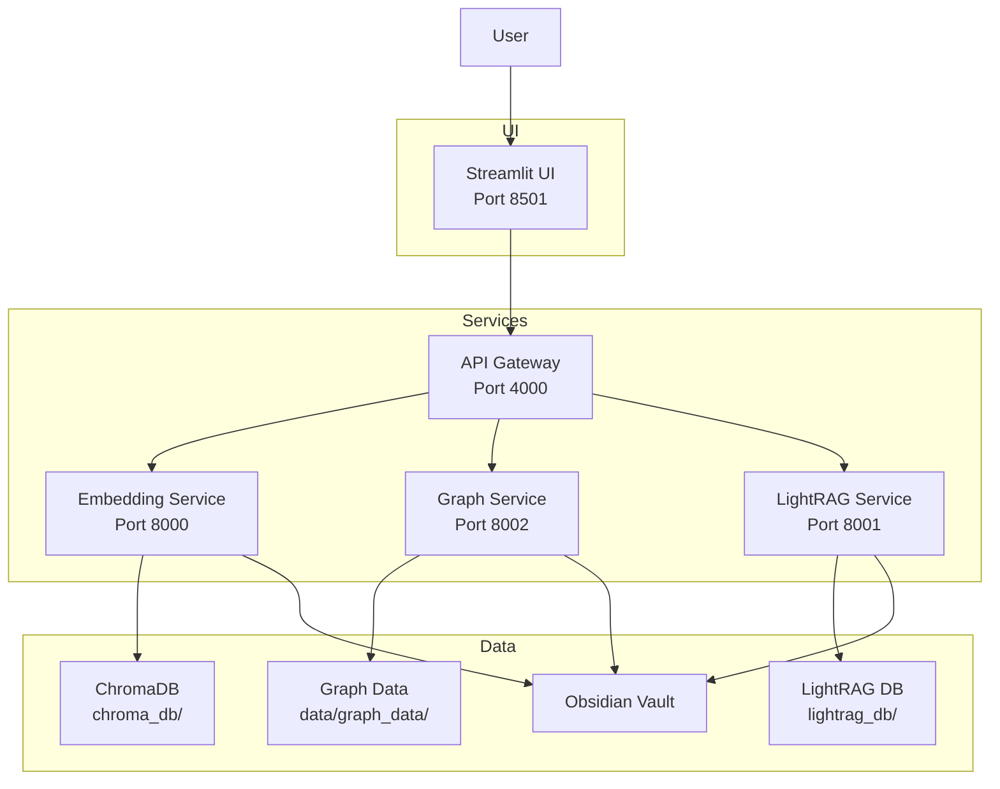

# System Architecture

This diagram reflects the current Docker services and their primary connections.

```mermaid
graph TB
    User[User]

    subgraph UI
        Streamlit[Streamlit UI
Port 8501]
    end

    subgraph Services
        Gateway[API Gateway
Port 4000]
        Vector[Embedding Service
Port 8000]
        Graph[Graph Service
Port 8002]
        LightRAG[LightRAG Service
Port 8001]
    end

    subgraph Data
        Chroma[ChromaDB
chroma_db/]
        GraphData[Graph Data
data/graph_data/]
        LightData[LightRAG DB
lightrag_db/]
        Vault[Obsidian Vault]
    end

    User --> Streamlit --> Gateway
    Gateway --> Vector
    Gateway --> Graph
    Gateway --> LightRAG

    Vector --> Chroma
    Vector --> Vault
    Graph --> GraphData
    Graph --> Vault
    LightRAG --> LightData
    LightRAG --> Vault
```

See `Documentation/SYSTEM_OVERVIEW_2025.md` for service roles and ports.
