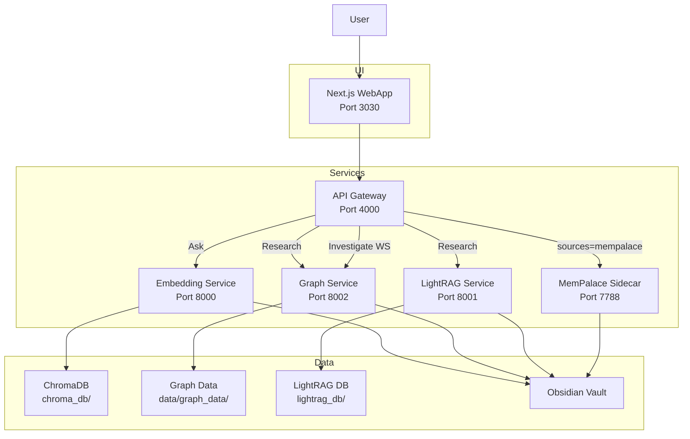

# System Architecture

This diagram reflects the current Docker services and their primary connections.

See `Documentation/reference/governance/PROJECT_CONSTITUTION.md` for the current authoritative service roles and ports.
