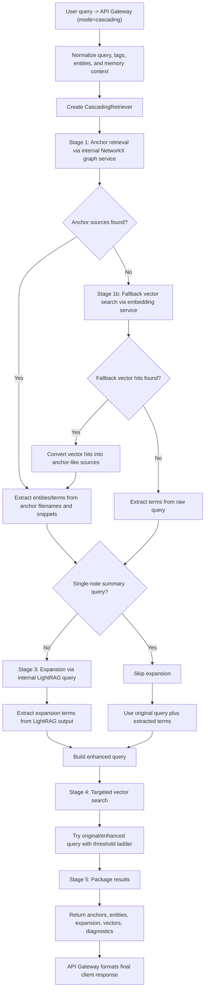

# Cascading Retrieval Flow

This document describes how the current `cascading` search mode works at runtime.

`cascading` is a staged retrieval pipeline. It does not expose graph or LightRAG as separate public modes, but it still uses both internally.

## Public Contract

- Entry point: `POST /api/v1/query`
- Supported mode value: `cascading`
- Current implementation entry:
  - `src/services/api_gateway.py`
  - `src/services/cascading_retriever.py`

## Step-by-Step Flow

1. The API gateway receives a request with `mode="cascading"`.
2. The gateway normalizes the retrieval query, extracts tags and entities, and loads memory context if enabled.
3. The gateway constructs `CascadingRetriever` with:
   - embedding service URL
   - internal NetworkX graph service URL
   - internal LightRAG service URL
4. Stage 1, anchor retrieval:
   - the retriever calls the internal graph service
   - goal: find structurally relevant anchor notes and graph-grounded sources
5. Stage 1b, vector fallback:
   - if graph anchors are empty, the retriever queries the embedding service
   - vector hits are converted into anchor-like sources
6. Stage 2, entity extraction:
   - terms are extracted from anchor filenames and snippets
   - if anchors are weak or empty, terms are extracted directly from the query
7. Stage 3, concept expansion:
   - unless the query looks like a single-note summary request, the retriever calls LightRAG
   - goal: expand the concept set with related entities and supporting context
8. Stage 4, targeted vector retrieval:
   - original query terms, extracted entities, and expansion terms are combined
   - the retriever tries vector search with a threshold ladder until it finds useful hits
9. Stage 5, packaging:
   - the retriever returns anchors, entities, expansion output, vector hits, and diagnostics
10. Final response formatting:
   - the API gateway formats sources and answer content for the client response

## Runtime Flowchart

## Internal Dependencies

The current `cascading` implementation still depends on these internal services:

- embedding service for vector retrieval
- NetworkX graph service for anchor retrieval
- LightRAG service for concept expansion

Those are internal runtime dependencies, not public user-selectable modes.

## Important Behavior Notes

- Anchor retrieval prefers graph-grounded sources first.
- Vector fallback prevents a hard failure when graph anchors are empty.
- Expansion is skipped for some single-note summary style queries to avoid over-expanding a focused request.
- Targeted vector search tries multiple query/threshold combinations before giving up.
- The response includes stage diagnostics, which helps debug retrieval quality and failures.

## Code References

- [api_gateway.py](/Users/michel/Library/Mobile%20Documents/com~apple~CloudDocs/ai/RAG/obsidian_rag/src/services/api_gateway.py#L2662)
- [cascading_retriever.py](/Users/michel/Library/Mobile%20Documents/com~apple~CloudDocs/ai/RAG/obsidian_rag/src/services/cascading_retriever.py)
