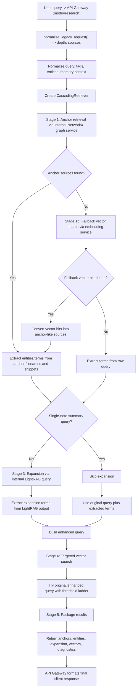

# Research Mode Flow

This document describes how the `research` search mode works at runtime.

`research` (previously `cascading`) is a staged retrieval pipeline. It does not expose graph or LightRAG as separate public modes, but it still uses both internally.

## Public Contract

- Entry point: `POST /api/v1/query`
- Supported mode value: `research` (legacy: `cascading` still accepted)
- Optional fields: `depth` (`auto` | `shallow` | `staged` | `full`), `sources` (`vault` | `mempalace` | `web`)
- Implementation:
  - `src/services/api_gateway.py`
  - `src/services/query_dispatch.py`
  - `src/services/cascading_pipeline.py`

## Step-by-Step Flow

1. The API gateway receives a request with `mode="research"`.
2. `normalize_legacy_request()` in `query_dispatch.py` resolves canonical mode, depth, and sources.
3. The gateway normalizes the retrieval query, extracts tags and entities, and loads memory context if enabled.
4. The gateway constructs `CascadingRetriever` with embedding service URL, internal NetworkX graph service URL, and internal LightRAG service URL.
5. Stage 1, anchor retrieval:
   - the retriever calls the internal graph service
   - goal: find structurally relevant anchor notes and graph-grounded sources
6. Stage 1b, vector fallback:
   - if graph anchors are empty, the retriever queries the embedding service
   - vector hits are converted into anchor-like sources
7. Stage 2, entity extraction:
   - terms are extracted from anchor filenames and snippets
   - if anchors are weak or empty, terms are extracted directly from the query
8. Stage 3, concept expansion:
   - unless the query looks like a single-note summary request, the retriever calls LightRAG
   - goal: expand the concept set with related entities and supporting context
9. Stage 4, targeted vector retrieval:
   - original query terms, extracted entities, and expansion terms are combined
   - the retriever tries vector search with a threshold ladder until it finds useful hits
10. Stage 5, packaging:
    - the retriever returns anchors, entities, expansion output, vector hits, and diagnostics
11. Final response formatting:
    - the API gateway formats sources and answer content for the client response

Depth `shallow` skips stages 1–3 and goes directly to vector retrieval.
Depth `full` adds full-note MCP reads after stage 4.

## Runtime Flowchart

## Internal Dependencies

The current `research` implementation still depends on these internal services:

- embedding service for vector retrieval
- NetworkX graph service for anchor retrieval
- LightRAG service for concept expansion

Those are internal runtime dependencies, not public user-selectable modes.

## Important Behaviour Notes

- Anchor retrieval prefers graph-grounded sources first.
- Vector fallback prevents a hard failure when graph anchors are empty.
- Expansion is skipped for single-note summary style queries to avoid over-expanding a focused request.
- Targeted vector search tries multiple query/threshold combinations before giving up.
- The response includes stage diagnostics, which helps debug retrieval quality and failures.
- Provider-specific synthesis caps apply for local backends (Ollama, LM Studio).

## Code References

- `src/services/api_gateway.py`
- `src/services/query_dispatch.py`
- `src/services/cascading_pipeline.py`
