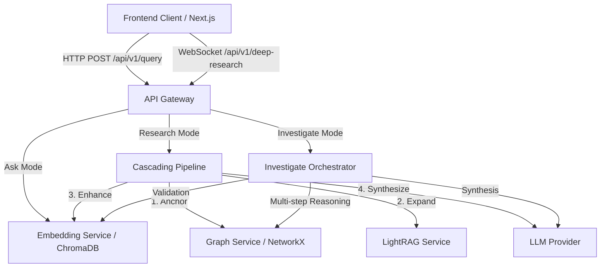
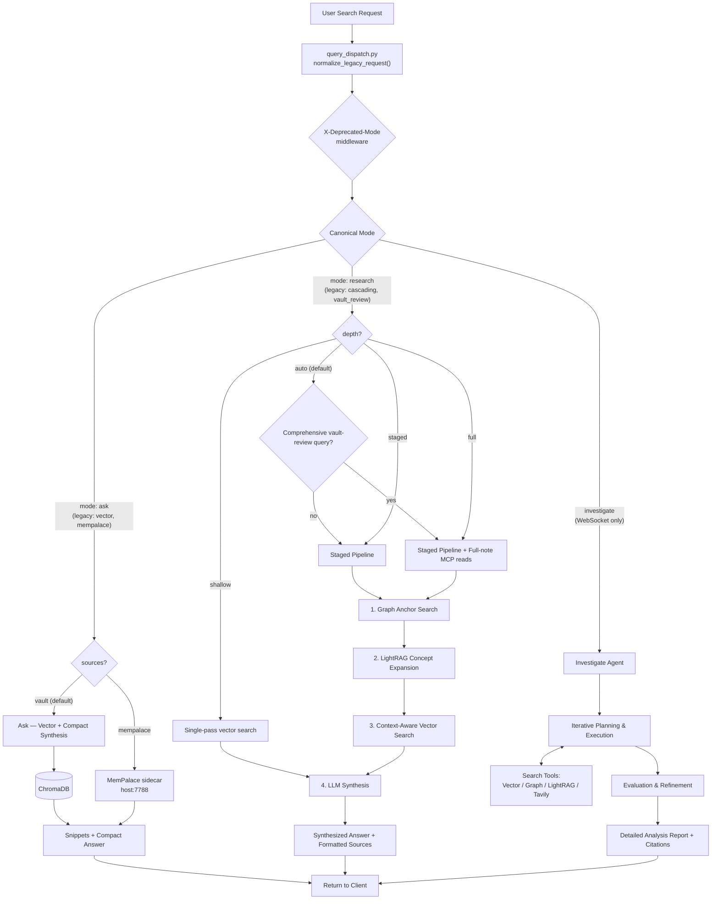

# Search Architecture

This document outlines the 3-mode search architecture for Obsidian RAG, as well as the overall application data flow.

Internal note:
- NetworkX and LightRAG remain deployed as internal retrieval subsystems behind `research` and `investigate`.
- They are not part of the supported public mode surface.

## Application Data Flow

## Search Modes Flowchart

The API Gateway supports three public search modes: `ask`, `research`, and `investigate`.

Implementation notes (cross-checked against `src/services/api_gateway.py` and `src/services/query_dispatch.py` on 2026-04-26):

- The `X-Deprecated-Mode` header is set by middleware (registered after CORS) so it survives both success and `HTTPException` paths.
- Auto-routing from `research` (depth=auto) to the legacy `vault_review` path is gated by `_is_comprehensive_vault_review_query` and is skipped when the user passes `depth=staged`.
- `mode=ask` with `sources=["mempalace"]` calls the host sidecar at `http://host.docker.internal:7788/search`. `mode=ask` with `sources=["web"]` is currently dispatched to the vault path (web-only ask is not yet a first-class mode).

## Key Characteristics

1. **Ask**: Fast, semantic retrieval using embeddings. Returns a compact synthesized answer plus source snippets.
2. **Research**: Thorough staged retrieval pipeline. Anchors the concept via graph, expands via LightRAG, falls back to targeted vector search, and synthesizes a grounded answer. Depth and sources are configurable.
3. **Investigate**: Agentic, multi-step problem solving over the WebSocket. A supervisor agent breaks down complex queries, iteratively gathers information, and synthesizes a comprehensive research report.

## Legacy Mode Compatibility

Legacy mode strings (`vector`, `cascading`, `vault_review`, `deep-thinking`) are normalised at the API boundary by `normalize_legacy_request()`. A `X-Deprecated-Mode` response header is emitted for tracking.

See `Documentation/reference/search/SEARCH_MODES_GUIDE.md` for the full compatibility map.
