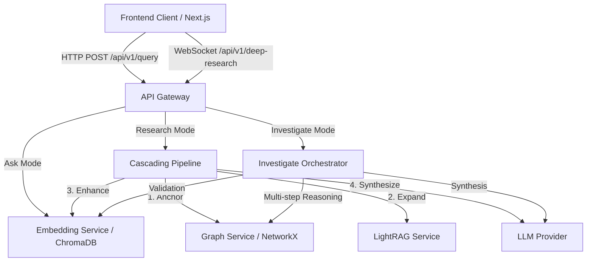
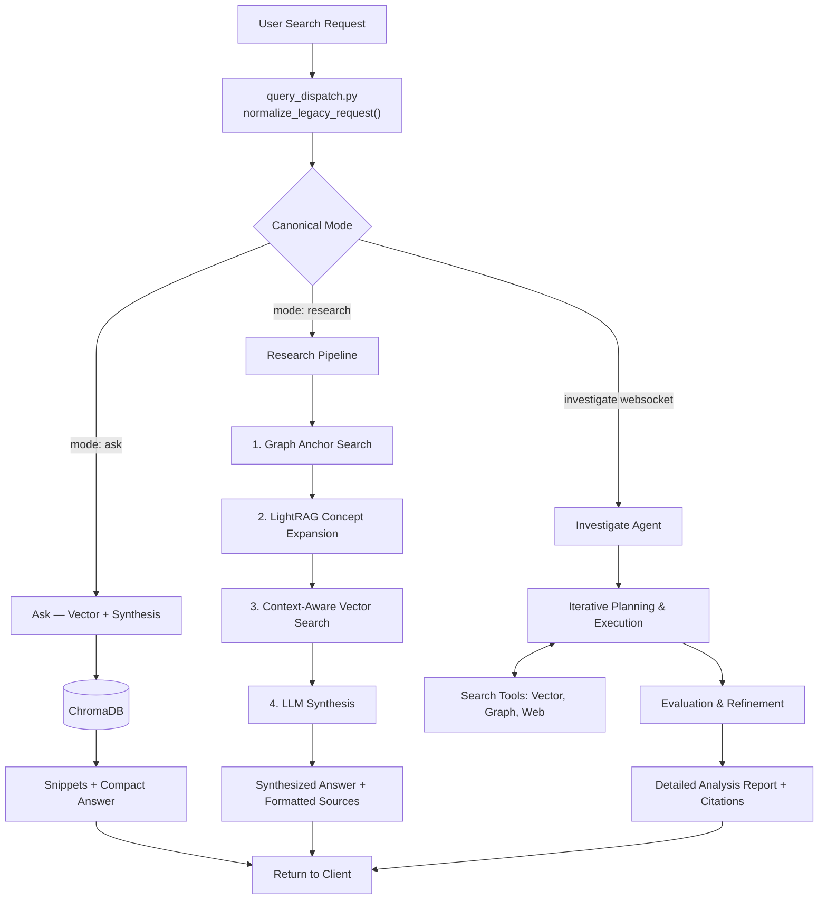

# Search Architecture

This document outlines the 3-mode search architecture for Obsidian RAG, as well as the overall application data flow.

Internal note:
- NetworkX and LightRAG remain deployed as internal retrieval subsystems behind `research` and `investigate`.
- They are not part of the supported public mode surface.

## Application Data Flow

## Search Modes Flowchart

The API Gateway supports three public search modes: `ask`, `research`, and `investigate`.

## Key Characteristics

1. **Ask**: Fast, semantic retrieval using embeddings. Returns a compact synthesized answer plus source snippets.
2. **Research**: Thorough staged retrieval pipeline. Anchors the concept via graph, expands via LightRAG, falls back to targeted vector search, and synthesizes a grounded answer. Depth and sources are configurable.
3. **Investigate**: Agentic, multi-step problem solving over the WebSocket. A supervisor agent breaks down complex queries, iteratively gathers information, and synthesizes a comprehensive research report.

## Legacy Mode Compatibility

Legacy mode strings (`vector`, `cascading`, `vault_review`, `deep-thinking`) are normalised at the API boundary by `normalize_legacy_request()`. A `X-Deprecated-Mode` response header is emitted for tracking.

See `Documentation/reference/search/SEARCH_MODES_GUIDE.md` for the full compatibility map.
